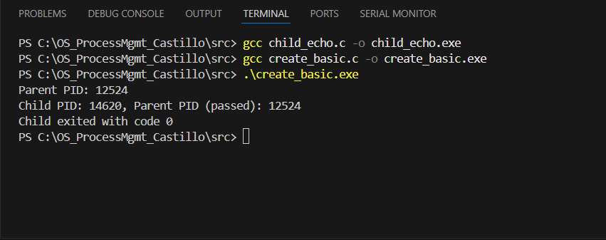
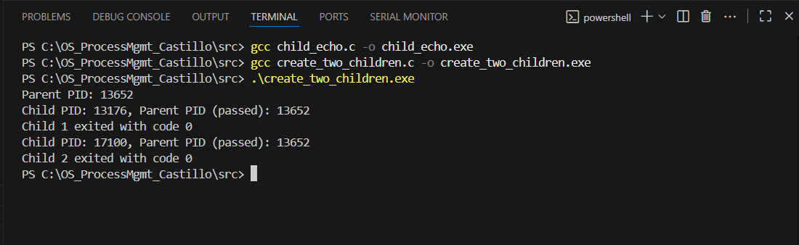
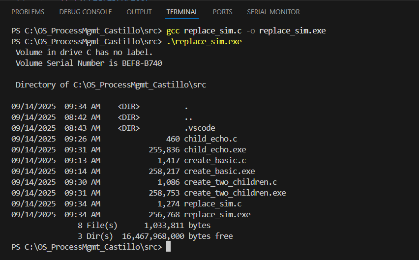
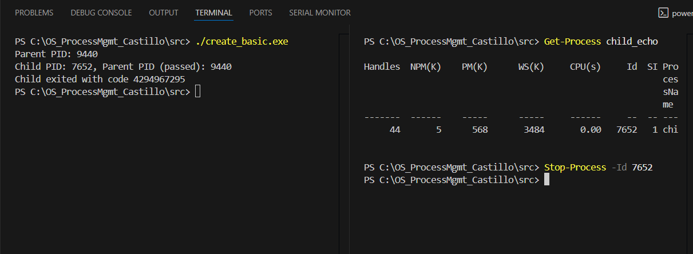

# OS Process Management Lab – README

## Quick Build Instructions

| Task | Compile Command(s) | Run Command |
|------|------------------|------------|
| Task A – Single Child | `gcc child_echo.c -o child_echo.exe`<br>`gcc create_basic.c -o create_basic.exe` | `./create_basic.exe` |
| Task B – Two Children | `gcc create_two_children.c -o create_two_children.exe` | `./create_two_children.exe` |
| Task C – Simulating exec() | `gcc replace_sim.c -o replace_sim.exe` | `./replace_sim.exe` |
| Task D – Managing Processes in PowerShell | Run any parent program, e.g., `./create_basic.exe` | `Get-Process child_echo` / `Stop-Process -Id <PID>` |

---

## Pre-Lab Setup (Windows with VS Code and MinGW-w64)

1. **Install Software**
   - Install **MSYS2** (used only to install GCC and check version).
   - Install **Visual Studio Code**.
   - Open VS Code → **Extensions**, install **C/C++ extension** by Microsoft.

2. **Install GCC via MSYS2 and Verify**
   - Open the **MSYS2 MSYS terminal**.
   - Update the package database:
     ```
     pacman -Syu
     ```
   - Install GCC:
     ```
     pacman -S mingw-w64-x86_64-gcc
     ```
   - Verify installation:
     ```
     gcc --version
     g++ --version
     ```

3. **Set Environment Variable (PATH)**
   - Press **Windows Key + Pause/Break** → **Advanced system settings** → **Environment Variables**.
   - Under **System variables**, select **Path** → **Edit** → **New**, add:
     ```
     C:\msys64\mingw64\bin
     ```
   - Click **OK** to save.
   - Open a new terminal and check GCC is accessible:
     ```
     gcc --version
     g++ --version
     ```

4. **Update VS Code Settings (settings.json)**
   - Press **Ctrl + ,** → click **Open Settings (JSON)**.
   - Add/update compiler path:
     ```json
     {
         "C_Cpp.default.compilerPath": "C:/msys64/mingw64/bin/g++.exe",
         "C_Cpp.default.intelliSenseMode": "gcc-x64"
     }
     ```
   - Save the file.

5. **Create Project Folder**
   - Create a folder for your lab:
     ```
     OS_ProcessMgmt_Lastname
     ```
   - Inside, create a `src` folder for your `.c` files:
     ```
     OS_ProcessMgmt_Lastname/src
     ```

---

## Lab Tasks

### Task A – Creating a Single Child

**Compile:**
```bash
gcc src/child_echo.c -o child_echo.exe
gcc src/create_basic.c -o create_basic.exe
 ```
**Run:**
```bash
./create_basic.exe
```
**Sample Output:**



### Task B – Creating Two Children

**Compile:**
```bash
gcc create_two_children.c -o create_two_children.exe
 ```
**Run:**
```bash
./create_two_children.exe
```
**Sample Output:**



### Task C – Simulating exec()

**Compile:**
```bash
gcc replace_sim.c -o replace_sim.exe
 ```
**Run:**
```bash
./replace_sim.exe
```
**Sample Output:**



### Task D – Managing Processes in PowerShell

**Run:**
```bash
./create_basic.exe
 ```
**Run:**
```powershell
Get-Process child_echo
Stop-Process -Id <PID>
```
**Sample Output:**



---

## Conclusion

This lab provided hands-on experience with fundamental process management concepts in operating systems. By creating and managing processes, simulating `exec()` behavior, and using PowerShell to observe process states, the tasks demonstrated how theory translates into practice. The included sample outputs and screenshots serve as references for verifying correct implementation and understanding the results.


